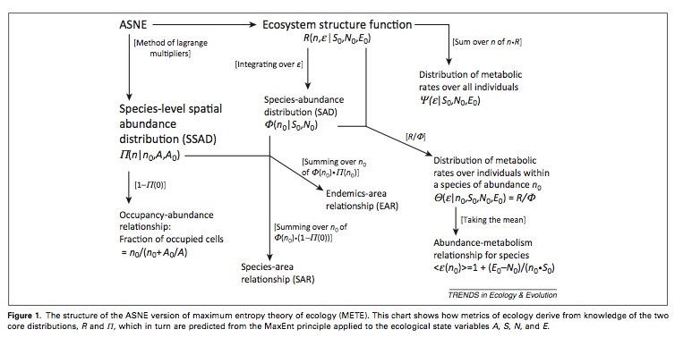

<!--  rmarkdown::html_vignette % this doesn't seem to allow TOC-->

<!-- For more details on using R Markdown see <http://rmarkdown.rstudio.com>. 
#TO DO
ADD TOC
FIX latex
-ADD data refs
-how to handle plotting when just the state varaibles are specified? - make it so you can add this to the the plot via just a line?
-->

```{r setup, include=FALSE}
knitr::opts_chunk$set(cache=TRUE)
```

<!--========================================================================-->
#Introduction
The package meteR is designed to facilitate fitting the models for the Maximum Entropy Theory of Ecology (METE) from data. For an overview of METE, see Harte et al. (2008), Harte (2011), and Harte and Newman (2014). Note that throughout this tutorial we use the notation for quantities used by the theory from these sources without extensive explanation. `meteR` can use data input in multiple formats and predict all the fundamental distributions of the theory (see Figure 1). Our objective is to facilitate tests of METE with empirical data sets. 

 

Figure 1 was taken from Harte and Newman (2014) TREE 29: 384–389.

<!--========================================================================-->
<!--========================================================================-->
<!--========================================================================-->

#Case Study 1 - Abundance and Power Distributions
We begin illustrating the capabilities of `meteR` with data from an arthropod community (data ref; more info). These data are distributed as part of `meteR`. We will use it to illustrate the construction of distributions related to abundance and energy. Notably, these data do not contain any spatial information so we illustrate spatial predictions with a different data set in the next section.

```{r}
library(meteR)
data(arth)
dim(arth)
head(arth)
```
This data set illustrates one data format used by `meteR`; each row represents an individual, with an observation of its metabolic rate (note that we convert mass to metabolic rate using the usual relationship of Metabolic Scaling Theory such that metabolic rate $M=mass^{3/4}$). If multiple individuals of the same size are observed, these can be specified as well (i.e., `arth$count` is something other than 1.) For an example of such formatting see the data set `anbo`, included with  `meteR`, discussed in the next section. There are two main reasons to provide data to `meteR`: (1) `meteR` will calculate the state variables $N_0$ (number of individuals), $S_0$ (number of species), $E_0$ (total metabolic rate), $A_0$ (total area) and relevant summary statistics for you; (2) these data are used by `meter` to compare against predictions. If data are not provided, the values for the state variables can be directly specified by the user (see Case Study 3).

Analysis begins by building the ecosystem structure function (ESF; $R(n,e)$) from which all non-spatial macroecological metrics can be derived. $R(n, e)$ describes the joint probability of observing a species with $n$ individuals and a randomly choosen member of that species having metabolic rate $e$. METE computes this distribution by maximizing information entropy relative to the constraints of $N_0/S_0$ and $E_0/S_0$ using the method of Lagrange multipliers. In `meteR` we achieve this as follows:
```{r}
esf1=meteESF(spp=arth$spp,
            abund=arth$count,
            power=arth$mass^(3/4),
            minE=min(arth$mass^(3/4)))
esf1
str(esf1)
```
Note that we use the terms 'power' and 'metabolic rate' interchangeably. The returned object (of class `meteESF`) contains useful information. In addition to returning the inputs (in analogy, e.g., to common model fitting functions such as `lm()`), it returns the Lagrange multipliers as well as information about the fitting procedure. Note that we specified the minimum value for the metabolic rate, but that the minimum observed value will be taken by default. 

<!--========================================================================-->
<!--========================================================================-->

## Species Abundance Distribution (SAD)
From the ESF, we can predict macroecological patterns. We begin with the species abundance distribution (SAD).
```{r}
sad1=sad(esf1)
sad1
```
`sad.meteESF` extracts the SAD and provides density (d), probability (p) and quantile (q) functions, as well as random number generation (r) for the distribution (see these with `str(sad1)`). This specification follows the conventions used by commonly used statistical distributions in the `stats` package (e.g. see `?rnorm`). These distributions allow us to use the model in a number of ways. You can access these functions directly as follows; e.g. randomly generating samples from the fitted distribution or determining the quantiles.
```{r}
sad1$r(20)
sad1$q(seq(0,1,length=10))
```
`meteR` readily plots the SAD as either a rank-abundance distribution (`ptype=rad`) or a cumulative distribution (`ptype=cdf`) (and other predicted distributions):
```{r fig.width=7, fig.cap="Different ways of plotting the SAD"}
par(mfrow=c(1,2))
plot(sad1, ptype='rad')
plot(sad1, ptype='cdf')
```

`meter` provides functions to assess model fit based on likelihood and residuals. First, we illustrate likelihood methods:

```{r, fig.width=5, fig.cap="Likelihood-based z-score."}
#== calculate the liklihood of the data, given the fitted model
logLik(sad1)
#== randomly generate 100 data sets from the fitted distribution and calculate
#== the z-score of the data w.r.t. these simulations
llz=logLikZ.meteDist(sad1, nrep=100, return.sim=TRUE)
llz$z
#== plot the distributions
plot(density(llz$sim),
     xlim=range(c(llz$sim,llz$obs)),
     xlab='log(likelihood)',col='red')
#== add 95% quantile region
abline(v=quantile(llz$sim, c(0.025, 0.975)), col='red')
#== add observed likelihood
abline(v=llz$obs,lty=2)
legend('top',legend=c('data','simulated\nfrom METE'),
       col=c('black','red'), lty=c(1,1),bty='n') 
```

Because the likelihood of the observed data falls within the 95\% quantile region of the simulated likelihoods, we have confidence that the model provides a good fit.

Note that other utilities that extract liklihoods from model objects are also useful, including AIC thus opening up all model comparison capabilities in `R` and its contributed pacakges:
```{r}
AIC(sad1)
```

Next, we illustrate methods relying on residuals to assess model fit. Residuals can be calculated either on the rank abundance (`type='rank'`) or cummulative (`type='cummulative'`) distribution and can be calculated as relative residuals ($(x_i - \hat{x})/\hat{x}$) or absolute ($x_i - \hat{x}$) by setting argument `relative` to `TRUE` or `FALSE` respectively. Relative residuals can be thought of as the proportional difference between observed and expected abundance or probability. From this mean squared error can be calculated and used to evaluate model fit. Although both rank abundance and cummulative density options are availible, we recommend only using rank abundance as cumulative density is constrained at upper and lower bounds and so its residuals will not be as reliable.

```{r}
#== calculate the residuals from the fitted distribution
head(residuals(sad1))
head(residuals(sad1, type='cumulative', relative=FALSE))
#== calculate the mean-squared error
mse.meteDist(sad1, type='rank', relative=FALSE)
#== randomly generate 100 data sets from the fitted distribution and calculate
#== the z-score of the data w.r.t. these simulations
msez.rank=mseZ.meteDist(sad1, nrep=100, return.sim=TRUE, type='rank')
msez.rank$z
#== plot the distributions
plot(density(msez.rank$sim),
     xlim=range(c(msez.rank$sim,msez.rank$obs)),
     xlab='Mean squared error',col='red')
#== add 95% quantile region
abline(v=quantile(msez.rank$sim, c(0.025, 0.975)), col='red')
#== add observed likelihood
abline(v=msez.rank$obs,lty=2)
legend('top',legend=c('data','simulated\nfrom METE'),
       col=c('black','red'), lty=c(1,1),bty='n') 
```

Here again we fail to reject METE as the model that generated the observed data (the obserbed MSE is below the 95\% quantile region). We can also see that the distribution of errors is not as Gaussian shaped as the distribution of likelihoods. Thus although residuals can be useful (specificlaly we can see whether, e.g., common species are more or less common than predicted by METE) we recomend using likelihood for evaluating model fit.

<!--========================================================================-->
<!--========================================================================-->

## Individual Power Distribution (IPD)

Similarly to the analyses illustrated above for the SAD, one can examine the individual power distribution (IPD; the distribution of metabolic rates, or power, over individauls in the community). We illustrate with an abbreviated version of the analyses above. First, fit and plot the IPD.

```{r fig.width=7, fig.cap="Different ways of plotting the IPD"}
ipd1=ipd(esf1)
ipd1
str(ipd1) # analogous structure to sad1 above
ipd1$r(8) # random number generation from fitted distribution

par(mfrow=c(1,2))
plot(ipd1, ptype='cdf')
plot(ipd1, ptype='rad')
```

Next, assess the fit of the IPD.

```{r fig.width=5, fig.cap="Likelihood-based z-score."}
head(residuals(ipd1))
logLik(ipd1)
logLikZ.meteDist(ipd1, nrep=100)
llz=logLikZ.meteDist(ipd1, nrep=100, return.sim=TRUE)
plot(density(llz$sim),xlim=range(c(llz$sim,llz$obs)),xlab='log(likelihood)',col='red')
abline(v=llz$obs,lty=2)
legend('top',legend=c('data','simulated\nfrom METE'),col=c('black','red'),
       lty=c(1,1),bty='n') 

```

Interestingly, although it appears that the data are unlikely to have been drawn from the METE distribution based on the z-score of the likelihood, the mean squared error suggests otherwise.

```{r fig.width=5, fig.cap="Mean squared error-based z-score."}
mse.meteDist(ipd1, type='rank', relative=FALSE)
mseZ=mseZ.meteDist(ipd1, nrep=100, return.sim=TRUE)
mseZ$z
plot(density(mseZ$sim),xlim=range(c(mseZ$sim,mseZ$obs)),xlab='mse',col='red')
abline(v=llz$obs,lty=2)
legend('top',legend=c('data','simulated\nfrom METE'),col=c('black','red'),
       lty=c(1,1),bty='n') 
```
<!--ANDY: What should the reader take away from this? discuss residuals vs. likelihoods. arth ipd is supported by residauls z but not liklihood. -->

We can also obtain the distribution of metabolic rates of individuals in a species with $n$ individuals ($\Theta$):
<!-- add if we figure out how to put equns in: (\eqn{\Theta( \epsilon \mid n, S_{0}, N_{0}, E_{0} ) \approx \lambda_{2} n e^{- \lambda_[2] n (\epsilon -1)}) with `sipd` with (for species 5) -->
```{r fig.width=5, fig.cap="Distribution of metabolic rates of individuals in a species with $n$ individuals"}
(sipd1 <- sipd(esf1, sppID=5))
plot(sipd1,xlab='metabolic rate')
```

<!--ANDY: what's the x axis? those aren't the right units for mass or energy... -->

<!--========================================================================-->
<!--========================================================================-->
<!--========================================================================-->

#Case Study 2 - Spatial distributions
Next, we illustrate with data from a desert grassland community known as anza 
borrego (ANDY: data ref). This data is distributed as part of meteR. We will use it to illustrate the construction of distributions related to abundance and area. Note that metabolic rate/body mass information are not available, but that we can still analyze many of METE's predictions related to abundance and spatial distribtion. As shown in case study 1 above, we can build the ESF and investigate the SAD.

```{r}
data(anbo)
head(anbo)
esf2=meteESF(spp=anbo$spp,
             abund=anbo$count)
str(esf2)
```

Note that when metabolic rate data are absent, `meteR` assumes a very large value for the state variable E0, such that terms involiving E0 can be safely ignored in distributions and relationships involving abundance.

```{r,fig.width=7,fig.cap="Different ways of plotting the SAD for the anbo data."}
(sad2=sad(esf2))
par(mfrow=c(1,2))
plot(sad1, ptype='rad')
plot(sad1, ptype='cdf')
```

To predict spatial distributions, the data need to be formatted such that the abundance of each is recorded in each cell even if that abundance is 0. The following will automatically fill in the necessary zeros if your data set is not already formatted in this way:

```{r,fig.width=7}
samp2mat <- function(site,spp,abund) {
    y <- tapply(abund, list(site, spp), sum)
    y[is.na(y)] <- 0
    return(y)
}

anbo.mat <- samp2mat(paste(anbo[, 1], anbo[,2]), anbo$spp, anbo$count)
anbo.new <- data.frame(t(sapply(strsplit(rownames(anbo.mat), ' ', fixed=TRUE), as.numeric)), 
                       spp = rep(colnames(anbo.mat), each=nrow(anbo.mat)), 
                       count = as.vector(anbo.mat))
colnames(anbo.new)[1:2] <- colnames(anbo)[1:2] ## anbo.new now has 0 abundance where needed
```

Analogous to the construction of the ESF above, we construct the Spatial Structure Function (SSF) (often denoted $\Pi (n)$ in the literature). Again, in analogy to how the SAD is constructed from the ESF, we can obtain the Species Spatial Abundance Distribution (SSAD) from the SSF.

```{r,fig.width=7,fig.cap="SSAD for the anbo data."}
pi1 <- meteSSF(anbo.new$count[anbo.new$spp=='crcr'], A=1, A0=16)
pi1
plot(ssad(pi1))
```

Next we predict the Species Area Relationship (SAR and EAR). We begin by predicting the number of species at scales smaller than the total plot size. For this we need to combine the ESF and the SSF. Note the the EAR is obtained with `downscaleSAR` with the option `EAR=T`. ANDY - Add explanation of the reason for upscaling and downscaling and the challenges.

<!-- note that we don't actually have meteSAR in here. should we? -->?

```{r,fig.width=7,fig.cap="The SAR (black) and EAR (blue) for the anbo data. In this example, there are 24 species distributed across 16 quadrats, hence the SAR and EAR converge at 24 species at an area of 16. "}
anbo.esf <- meteESF(spp=anbo.new$spp, abund=anbo.new$count) 
anbo.thr.downscale <- downscaleSAR(anbo.esf, 2^(seq(-3, 4, length=17)), 16)
anbo.thr.downscale
anbo.thr.downscaleEAR <- downscaleSAR(anbo.esf, 2^(seq(-3, 4, length=17)), 16, EAR=TRUE)
plot(anbo.thr.downscale, ylim=c(0, max(anbo.thr.downscale[['S']])))
plot(anbo.thr.downscaleEAR, col='blue', add=TRUE)
```
In this example, there are 24 species distributed across 16 quadrats, hence the SAR and EAR converge at 24 species at an area of 16. 

<!-- ANDY: is there an easy way to get confidence intervales on these predictions? would you have to bootstrap the data or is there a more elegant option? More generally, can you think of a generic way to get intervals on any of the predictions or meter? Mabye theres a slick way to usea bootstrapping package and just run each of our functions in jsut a few lines?-->


<!-- ANDY: Can you add text/edit the relevant parts for this next chunk? I was sure what the objective was... The last plot doesn't work, so it was commented out.
```{r,fig.width=7}
## empirical SAR and EAR
anbo.obs.sar <- empiricalSAR(anbo$spp, anbo$count, anbo$row, anbo$col, Amin=1, A0=16)
plot(anbo.obs.sar)

anbo.obs.ear <- empiricalSAR(anbo.new$spp, anbo.new$count, anbo.new$row, anbo.new$col, Amin=1, A0=16, EAR=TRUE)
plot(anbo.obs.ear)

## the meteRelat object combining theoretical and observed SAR

## combine SAR for scales at which we have data with upscaled SAR
anbo.sar <- meteSAR(anbo.new$spp, anbo.new$count, anbo.new$row, anbo.new$col, Amin=1, A0=16)
anbo.sar
#plot(anbo.sar, xlim=c(1, 2^10), ylim=c(3, 50), log='xy')
```
-->

We can also use the SAR to predict the number of species at areas larger than those observed in the study (i.e. upscaling). Upscaling proceeds by sequentially doubling the area and predicting species richness (ANDY- I recall there were a few options - what did you choose and why?). To infer richness at areas intermediate between those on the doubling scale, one can simply interpolate.
```{r,fig.width=7, fig.cap= 'Species-Area data (circles) and the upscaled prediction from the SAR (blue line).'}
anbo.sarUP <- upscaleSAR(anbo.esf, 16, 2^10)
anbo.obs.sar <- empiricalSAR(anbo$spp, anbo$count, anbo$row, anbo$col, Amin=1, A0=16)
plot(anbo.obs.sar,xlim=c(1, 2^10), ylim=c(3, 50), log='xy') # plot the data
plot(anbo.sarUP, add=TRUE, col='blue') # add upscaled prediction
```

<!-- ANDY: Seems like the following doens't need to be in the vignette. reason to keep? 
```{r,fig.width=7,fig.cap='Species-Area data (circles) and the upscaled prediction from the SAR (blue line).'}
# ## empirical SAR and EAR from simulated x, y data
# anbo$x <- runif(nrow(anbo), 0, 1) + anbo$column
# anbo$y <- runif(nrow(anbo), 0, 1) + anbo$row
# meteSAR(anbo$spp, anbo$count, x=anbo$x, y=anbo$y, row=4, col=4)
# 
# plot(empiricalSAR(anbo$spp, anbo$count, x=anbo$x, y=anbo$y, row=4, col=4))
# plot(empiricalSAR(anbo$spp, anbo$count, row=anbo$row, col=anbo$column, Amin=1, A0=16), col='red', add=TRUE)
```
-->

<!--========================================================================-->
<!--========================================================================-->
<!--========================================================================-->

# Case Study 3 - Specifying the state variables
`meteR` allows the user to manually specify the state variables, which can be useful to buld models from data structures not accomodated by `meteR` or to explore how METE predictions vary as a function of state variables. 

```{r,fig.width=7}

esf3=meteESF(N0=4000,S0=50,E0=1e5,minE=1)
sad3=sad(esf3)
ipd3=ipd(esf3)
par(mfrow=c(1,2))
plot(sad3)
plot(ipd3)
```

Similarly, one can predict spatial distributions from the state variables. First, we downscale the species area relationsip.

```{r,fig.width=7}
## theoretical SARs from state variables only
thr.downscale <- downscaleSAR(meteESF(S0=40, N0=400), 2^seq(-1, 4, by=0.25), 16)
thr.downscaleEAR <- downscaleSAR(meteESF(S0=40, N0=400), 2^seq(-1, 4, by=0.25), 16, EAR=TRUE)
plot(thr.downscale, ylim=c(0, 40), col='red')
plot(thr.downscaleEAR, add=TRUE, col='blue')
```

We can also upscale the SAR. 
```{r,fig.width=7}
thr.upscale <- upscaleSAR(meteESF(S0=40, N0=400), 2^(-1:4), 16)
```

<!--
For example, we could explore how the SAD and IPD vary as a function of N0.
```{r,fig.width=7}
#N0s=c(50,100,200,400,800,1600,3200,6400)
#esf4=sad4=ipd4=vector('list',8)
#for(i in 1:length(N0s)){
#  esf4[[i]]=meteESF(N0=N0s[i],S0=50,E0=1e5,minE=1)
#  sad4[[i]]=sad(esf4[[i]])
#  ipd4[[i]]=ipd(esf4[[i]])
#}

#par(mfrow=c(1,2))
#plot(sad4[[i]])
#for(i in 1:length(N0s)){ 

#}
#plot(sad3)
#plot(ipd3)
```
-->
<!--========================================================================-->

# References
* Harte, J. 2011. Maximum entropy and ecology: a theory of abundance, distribution, and energetics. - Oxford University Press.
* Harte, J. et al. 2008. Maximum entropy and the state-variable approach to macroecology. - Ecology 89: 2700–2711.
* Harte, J. and Newman, E. A. 2014. Maximum information entropy: a foundation for ecological theory. - Trends in Ecology and Evolution 29: 384–389.


